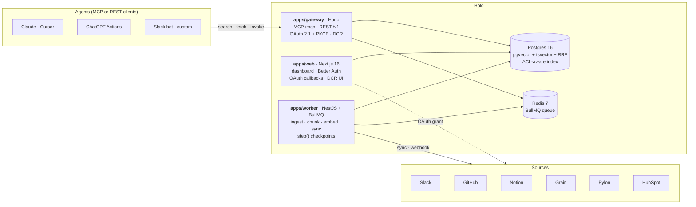

# Holo

> **The agent context layer for your company.** Connect your tools once. Holo unifies the data, learns the procedures your team actually runs, and exposes them as callable tools over MCP and OpenAPI — so any agent (Claude, Cursor, ChatGPT, your own) plugs into the same foundation, with scoped access and full observability.
>
> **Bring your own agent. Layer today. Agent OS tomorrow.**

**Status:** Pre-alpha. 9/9 connectors live (Slack, GitHub, Notion, Grain, Pylon, HubSpot, Linear, Mintlify Docs, Zendesk Help Center), hybrid RRF search, MCP + REST/OpenAPI, DCR OAuth provider, observability + audit + skill marketplace shipped. Not yet ready for production traffic; internal dogfood underway.

---

## How it works

1. **Connect** the tools your work lives in (Slack, GitHub, Notion, Grain, Pylon, HubSpot, Linear, Mintlify Docs, Zendesk Help Center — more on the roadmap). One OAuth per source, allowlist-scoped at ingestion.
2. **Unify.** Holo ingests, chunks, embeds, and indexes. Hybrid retrieval (pgvector + tsvector fused with RRF) over a single ACL-aware index.
3. **Expose.** A small set of MCP tools and a parallel REST/OpenAPI surface let any agent — internal or external — search, fetch, and invoke learned procedures.
4. **Observe.** Every agent call is logged, attributable, and replayable. Today: ingestion-time allowlists bound which channels, repos, and pages enter Holo at all. Next: per-agent tool allowlists and row-level data scopes finish the personas model.

**The wedge in one sentence:** stop re-implementing context fetchers per agent, and stop letting agents see everything just because the OAuth token does.

---

## The name

Holo is named after the Star Wars *holocron* — a small object encrypted with compressed knowledge from many sources, accessed by anyone with the right key. We shortened it to **holo** because nobody wants to type `holocron init` every time.

The metaphor maps directly: a holocron compresses what many people knew into one object any Jedi could query. Holo compresses what your company's tools collectively know into one endpoint any agent on your team can call. Same shape, different century.

---

## Why this exists

Engineering teams in 2026 don't ship one custom AI agent — they ship several. A Slack-triggered Cursor agent over the codebase. A Notion-based agent that prepares interview rubrics from Grain recordings. A customer-success copilot over Pylon and HubSpot. Each agent solves a different workflow. Each one re-implements its own context-fetching pipeline.

The cost compounds with every new agent. Cross-agent context is impossible because the context layer is a per-agent fork. When a Notion page moves or a Slack channel archives, every agent breaks individually.

Holo is the missing shared layer — the **queryable context layer** under all your team's agent operations and the **procedural extraction layer** that turns scattered artifacts into invokable skills. Two adjacent YC RFSs ([AI Operating System for Companies](https://www.ycombinator.com/rfs#ai-operating-system-for-companies), Diana Hu; [Company Brain](https://www.ycombinator.com/rfs#company-brain), Tom Blomfield) describe the bet. Holo is the open-source, self-hostable take.

**Who runs Holo:** CTOs and lead engineers at 30–80-person tech companies maintaining 2+ custom agents in production. Buyer = builder = sufferer collapsed into one role.

**Who consumes Holo:** every agent on their team. Claude in Cursor over the codebase. A custom Slack bot for support. ChatGPT Actions for an external partner. An internal copilot for customer success. None of them re-implement the retrieval layer; all of them inherit the same scopes, the same audit trail, and the same set of learned procedures.

---

## Architecture

Three apps. 19 packages. AGPL-3.0.



| Layer | Choice |
|---|---|
| Dashboard | **`apps/web`** — Next.js 16, React 19. Marketing, sign-in, sidebar app shell, all OAuth callbacks, MCP DCR endpoints. |
| Gateway | **`apps/gateway`** — Hono. MCP JSON-RPC at `POST /mcp` *and* OpenAPI/REST at `/v1/*`. Scalar API reference at `/docs`. Default port `8080`. |
| Worker | **`apps/worker`** — NestJS standalone + BullMQ. Per-connector ingestion, embedding pipeline, sync scheduler with cursor store, ACL extraction. `step()` checkpoint helper for crash-resumable jobs. |
| ORM / DB | Drizzle 0.45 on Postgres 16 + pgvector + pg_trgm |
| Cache / Queue | Redis 7 (`maxmemory-policy=noeviction`) |
| Auth | Better Auth 1.6 — GitHub OAuth + email OTP (Resend); multi-tenant `organization` plugin; OAuth-provider routes for MCP DCR (RFC 7591 / 9728 / 8414). |
| Search | `packages/retrieval-core` — pgvector + tsvector fused with RRF in a single SQL CTE; dual-model embedding fallback (OpenAI + Voyage); `acl_subjects && user_subjects` filter. |
| Connectors | `packages/connectors` — Slack, GitHub, Notion, Grain, Pylon, HubSpot, Linear, Mintlify Docs, Zendesk Help Center. Allowlist enforcement via the `connector_allowlists` table (glob or exact-id, audit-trailed). |
| Skills | `packages/skills` — Anthropic skill format, golden-set + ROUGE-L eval harness, marketplace publish flow with redaction. MCP exposes `list_skills`, `get_skill`, `execute_skill`. |
| Custom tools | `packages/custom-tools` — CLI-as-tool registration (e.g. `bq query`, `psql -c …`) without writing a connector. |
| CLI | `packages/cli` — `npx @holo/cli init`. |

Full reasoning, alternatives, and migration paths in [`docs/ARCHITECTURE.md`](./docs/ARCHITECTURE.md).

---

## Quickstart (self-host)

```bash
mkdir my-holo && cd my-holo
npx @holo/cli init
# fill the placeholders the wizard prints in .env, then:
docker compose up -d
open http://localhost:3000
```

**Requirements:** Docker 24+, Node 20+ (only for `npx`).

**Connect your agent:**

```json
{
  "mcpServers": {
    "holo": {
      "url": "http://localhost:8080/mcp",
      "headers": { "Authorization": "Bearer <token-from-/connect-agent>" }
    }
  }
}
```

REST equivalent:

```bash
curl -X POST http://localhost:8080/v1/search \
  -H "Authorization: Bearer <TOKEN>" \
  -H "Content-Type: application/json" \
  -d '{"q": "how do we onboard a new ATS partner?", "topK": 5}'
```

---

## Deploy (Railway · Coolify)

[](https://railway.com/new/template?template=https%3A%2F%2Fgithub.com%2Fmaakle%2Fholo)

**Coolify** has no universal 1-click URL (instances are self-hosted). Import flow: in your Coolify dashboard → *New Resource* → *Public Repository* → paste `https://github.com/maakle/holo` → select `docker-compose.yml`. Coolify auto-detects services. The `coolify.json` at the repo root mirrors the same shape if you prefer the service-template path.

Both templates provision five services: `holo-web` (Next.js), `holo-gateway` (Hono MCP + REST), `holo-worker` (NestJS + BullMQ), `postgres` (`pgvector/pgvector:pg16`), and `redis` (`7-alpine`).

### How environment variables work

Three categories, three different mechanisms:

| Category | Vars | How they get set |
|---|---|---|
| **Auto-wired by the platform** | `DATABASE_URL`, `REDIS_URL` | Railway: reference variables (`${{Postgres.DATABASE_URL}}`, `${{Redis.REDIS_URL}}`) — set them once on `holo-web`/`holo-gateway`/`holo-worker` after the DB and Redis services come up. Coolify: when you attach a Postgres/Redis service to the project, both URLs are exposed as connection-string env vars on the same network. |
| **You generate (secrets)** | `POSTGRES_PASSWORD`, `BETTER_AUTH_SECRET`, `HOLO_TOKEN_ENCRYPTION_KEY` | `openssl rand -base64 32` for each. Paste into the project's env panel before the first deploy. `POSTGRES_PASSWORD` must match what `DATABASE_URL` references. |
| **You provide (public URLs + OAuth)** | `BETTER_AUTH_URL`, `WEB_PUBLIC_URL`, `MCP_PUBLIC_URL`, `GITHUB_LOGIN_CLIENT_ID`/`_SECRET`, `ANTHROPIC_API_KEY` | Set after the first deploy gives you the public hostnames. `BETTER_AUTH_URL` and `WEB_PUBLIC_URL` point at `holo-web`'s public URL; `MCP_PUBLIC_URL` points at `holo-gateway`'s. The GitHub OAuth app's callback must be `${BETTER_AUTH_URL}/api/auth/callback/github`. |

Connector credentials (Slack, GitHub App, HubSpot, Pylon, Notion, Grain) are **not** required at boot — leave them blank, deploy, then add them per-connector in the Holo dashboard once `apps/web` is reachable.

Full env reference: [`.env.example`](./.env.example).

> **Note on the Railway template format.** `railway.toml`'s multi-service block (`[[services]]`) is best-effort — Railway's first-class multi-service experience is via the published Template Marketplace, which we haven't shipped yet ([`docs/ROADMAP.md` ↗](./docs/ROADMAP.md)). After clicking the button, verify each service in the Railway dashboard and set reference variables. Tracking issue welcome.

---

## Development

```bash
git clone https://github.com/maakle/holo.git
cd holo && pnpm install
cp .env.example .env
# Generate secrets + fill in the two GitHub OAuth apps' IDs/secrets
docker compose up -d postgres redis
pnpm db:migrate
pnpm dev
```

Two GitHub OAuth apps are required (login + connector); see [decision 0001](./docs/decisions/0001-connector-port-interface.md) for why the split is intentional. Full setup notes in [`CONTRIBUTING.md`](./CONTRIBUTING.md). Per-connector OAuth setup (Slack, GitHub, etc.) lives in [`docs/connectors/`](./docs/connectors/).

---

## Roadmap and vision

- [`docs/ROADMAP.md`](./docs/ROADMAP.md) — what's next, milestone-by-milestone
- [`docs/VISION.md`](./docs/VISION.md) — why holo exists, in 200 words
- [`docs/decisions/`](./docs/decisions/) — architectural decision records

### Deferred from the MVP

The MVP is intentionally narrow: **connect tools → unify into a substrate → expose via MCP and OpenAPI → bring your own agent (Claude, Cursor, ChatGPT, Slack bot, etc.)**. Anything beyond that is parked.

Specifically, the following surfaces ship as **501 stubs** today and are deferred to a post-launch milestone:

- **Skills** (`/skills`) — manual artifact labeling and Claude-driven skill synthesis from labeled examples
- **Procedure auto-discovery** (`/skills/discover`, nightly cron) — clusters cross-connector artifacts into work episodes and proposes named procedures for the user to accept / reject
- **Skill runs** (`/skills/runs`) — execution history and observability for synthesized skills
- **Marketplace** (`/marketplace`) — publishing accepted skills for other orgs to install

The implementation is preserved in the repo (`packages/skills/`, `packages/discovery/`, `apps/web/src/lib/synthesize-and-persist.ts`, `apps/web/src/lib/discovery-db.ts`, the `procedure_*` tables) so re-enabling is route-handler restoration, not a re-build. The plan that produced the auto-discovery code is at [`docs/superpowers/plans/2026-05-05-procedure-auto-discovery.md`](./docs/superpowers/plans/2026-05-05-procedure-auto-discovery.md). Full implementation history is on the `feat/procedure-auto-discovery` branch through commit `38f49de`.

**Why deferred:** the auto-discovery loop only pays off once the substrate has rich cross-connector signal (Slack threads referencing PRs, Grain calls tagged to HubSpot deals, etc.). MVP design partners' data is mostly single-connector — the algorithm is correct but starves for input. We'd rather ship the substrate, expose it via MCP/OpenAPI, watch agents use it for a quarter, and let the procedure layer emerge from real usage instead of synthesizing it speculatively.

## Contributing

Read [`CONTRIBUTING.md`](./CONTRIBUTING.md) before opening a PR. First-time contributors will be prompted to sign the [`CLA`](./CLA.md). Good first issues tagged `good-first-issue`.

## License

[AGPL-3.0-or-later](./LICENSE).
